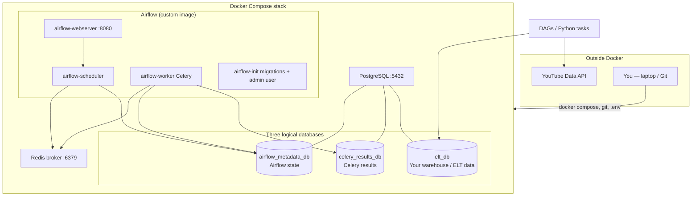
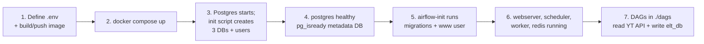
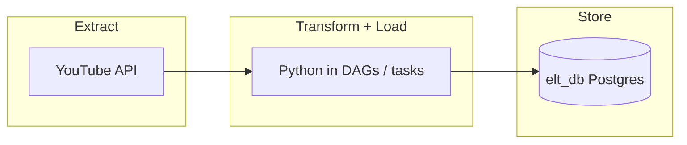
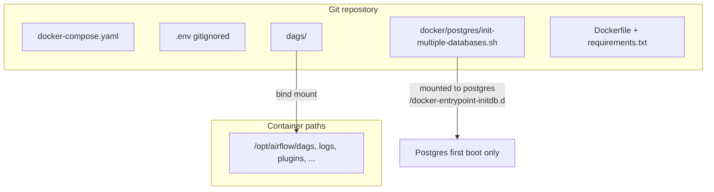
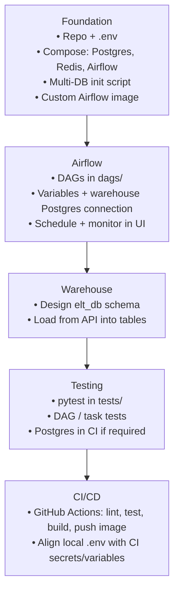

# YouTube ELT pipeline — architecture & roadmap

This document is a **memory map** of the project: what runs where, which tools are involved, and how work flows from local development toward Airflow, Postgres, testing, and CI/CD.

---

## 1. Big picture

You are building a **YouTube → extract/load → Postgres** pipeline, orchestrated with **Apache Airflow** in **Docker**, with a path toward **automated tests** and **CI/CD**.

---

## 2. System architecture (software & connections)

### Software by role

| Layer | Tools |
|--------|--------|
| Runtime / isolation | **Docker**, **Docker Compose** |
| Orchestration | **Apache Airflow 2.9.x** (**CeleryExecutor**) |
| Queue / workers | **Redis**, **Celery** (inside Airflow worker image) |
| Warehouse / stores | **PostgreSQL 13** — 3 DBs: metadata, Celery backend, **ELT** |
| Secrets / config | **`.env`** (not committed), variables referenced in **Compose** |
| DB bootstrap | **`docker/postgres/init-multiple-databases.sh`** (runs on Postgres **first** init only) |
| App image | **`Dockerfile`** extends **`apache/airflow`** + **`requirements.txt`** (+ project Python modules as needed) |
| Source API | **YouTube Data API** (`API_KEY`, `CHANNEL_HANDLE` via Airflow variables in compose) |

---

## 3. End-to-end startup flow

### Commands you will reuse

| Goal | Command (run from project root with `.env` present) |
|------|-----------------------------------------------------|
| Build image (tag must match `.env` `DOCKERHUB_*` / `IMAGE_TAG` if you use that registry) | `docker build -t <namespace>/<repo>:<tag> .` |
| Push image | `docker push <namespace>/<repo>:<tag>` |
| Start stack | `docker compose up -d` |
| Stop (keep volumes / data) | `docker compose down` |
| Stop and **delete** Postgres data (re-runs init script on next up) | `docker compose down -v` |
| Airflow CLI (debug profile in `docker-compose.yaml`) | `docker compose --profile debug run --rm airflow-cli airflow ...` |
| Follow logs | `docker compose logs -f <service>` |

---

## 4. Data / ELT mental model

Airflow **orchestrates** jobs; it does not replace Postgres. Tasks call the YouTube API and **load** into **`elt_db`**. The **metadata** and **Celery** databases exist for Airflow/Celery internals, not as your primary analytics store (unless you choose otherwise).

---

## 5. Repo layout vs what containers see

---

## 6. Roadmap (where you are → next)

---

## 7. One-sentence summary

**A Dockerized Airflow cluster (webserver, scheduler, Celery workers, Redis) uses Postgres for three databases; an init script creates app DBs on first boot; DAGs extract from YouTube and load into `elt_db`; testing and CI/CD automate quality and deployment next.**

---

## Viewing Mermaid diagrams

- [GitHub renders Mermaid in Markdown](https://github.blog/2022-02-14-include-diagrams-markdown-files-mermaid/) in `.md` files on the web.
- VS Code / Cursor: install a “Mermaid” preview extension if previews do not show by default.

---

## Related files in this repo

| File / path | Role |
|-------------|------|
| `docker-compose.yaml` | Services, env, volumes, healthchecks |
| `.env` | Secrets and parameters (local only; not committed) |
| `docker/postgres/init-multiple-databases.sh` | Creates metadata, Celery, and ELT DBs + users on first Postgres init |
| `Dockerfile` | Airflow-based image with extra Python dependencies |
| `dags/` | Airflow DAG definitions |
| `tests/` | Automated tests (to grow with the project) |
